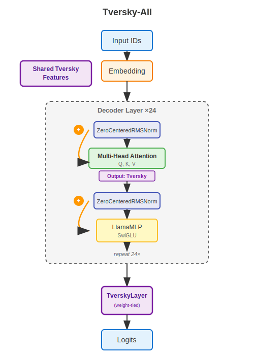
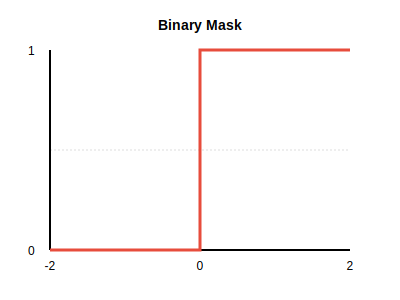
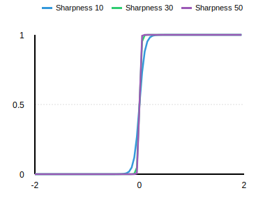

This is inspired by the tversky-all architecture outlined here but some major departures.

Paper: https://arxiv.org/abs/2506.11035

Testable weights: https://huggingface.co/Blackroot/Tversky-All-Test-100MIsh/tree/main

### ~

XOR test: https://github.com/CoffeeVampir3/Tverysky-Torch

Cifar10: https://github.com/CoffeeVampir3/Tversky-Cifar10/tree/main

Language model: https://github.com/CoffeeVampir3/Architecture-Tversky-All

### ~

### Vibe Check:
After substantial experimenting with this I'm convinced it will become a mainstay in some styles of neural networks. It is computable, nearly or as fast as equivalent linears, has nice properties as a result of sharable features and the paper claims they're interpretable which is a huge boon over linear layers. In some of my tests tversky layers soundly beats equivalent linears, and in most cases the outcomes are at least similar. Anyone interest in neural networks should at least give these a serious consideration, especially because they're simple and easy. Feel free to use the TverskyLayer code as you see fit.

In terms of this actual network, this Tversky-All variant achieved a final loss (on 10% of the data) of about ~2. This is on par with equivalent linear version that ended at about ~2.2 final loss.

### Key departures from the paper:

**Llama-Like** — This is closer to a llama/llama3 model than GPT2, although we are using the GPT2 tokenizer still. See the architectural diagram.

**No Rope or Positional Encodings** — Positional encoding are learned. See nope paper <https://arxiv.org/abs/2404.12224>

**Weight-decayed Zero Centered RMS Norm** — Inspired from Qwen 3 Next

**SwiGLU MLP** — MLP using Llama 3 swiglu formulation.

**Assumptions** — I made assumptions in many places where the paper doesn't specify exact details.

Basically, this is a substantially different than the GPT2 model in the paper.

### Key points from the paper:
**Tversky-All Setup** — This implements the Tversky-All strategy from the paper. In partciular, that means the output projections from MHA are tversky layers and the output head of the LLM is similarly a tversky layer. Notably, all tversky layers share the same feature bank. (Including the head, literally all of them share these.)

**Ignorematch with Product Intersection** — The particular variant of tversky is ignorematch with product intersections. I've also opted to use a slightly approximate tanh with sharpness over the binary mask in the paper.

### Why Approximate Tanh over Binary Mask?
The binary mask version learned objectively worse in my small test, had some stability concerns, and tended to kill neurons on my Cifar-10 tests early on. After testing both variants in a language model I'm quite convinced the tanh approximation makes it easier for the network to learn and has minimal downsides. (It does have downsides.) Although this constrains the kinds of variants of Tversky we can use, the network seems much more stable and more performant without the binary mask. By adjusting the steepness of the tanh curve we get closer and closer to a true binary mask. Basically, this gives us a "how close to binary" knob to turn while respecting differentiability.





### Why Ignorematch + Product Intersection?
First, let me address the reason to use Product + Ignorematch Intersection even though Product + Substractmatch showed slightly better results. This boils down to the nature of Product + substractmatch's neccesary dimensional coupling which forces us (I think, at least I couldn't come up with a solution) to have 3 dimensional intermediates. That is to say, with Product + Substractmatch given a `[batch, prototype, features]` tensor, it is neccesary to materialize `batch * prototypes * features]` sized intermediates which are simply massive. Conversly with Product + Ignorematch we can actually cleverly utilize the fact that tanh nearly approximates the binary mask with better gradients to get an almost perfectly approximate version that only materializes at worst `[batch * features]` (technically it materializes at worst the largest combination of two of the three dimensions, but it's usually going to be these two) which is SUBSTANTIALLY smaller. Basically, this boiled down to how computable the function was.

To drive this point home, lets use an actual example. In our output head, we have `[P=50257, F=4096]` because we're sequence packing the batches tend to be around 10,000. This means it's neccesary in the Product + Substractmatch with nice gradients to materialize `[50257 * 4096 * 10000]` -> `2,058,526,720,000 * 8` -> ~16.5 TB. You can see the problem. We can't use the nice gradient variants because of the neccesary coupling the indicator function (tanh in this case) produces.

### Why no Rope?
The equivalent model using just linears can learn to represent positional information during training and I wanted to be sure tversky was no losing this ability. Evidently, tversky is also able to learn positional information in the same way. I'm somewhat of a rope hater.

### Initialization is INSANELY important.
The values for initialization were very hard to arrive at and were a combination of inspection of variance and also experimentation.

**alpha > beta** — The paper notes that the tversky alpha learned to be > beta in their experiments. I forced this in initialization giving A a larger value than B.

**Shared Features** — This is shared by nearly the whole network. Bad initial values literally kills the entire net. Zeroes might be workable given a high initial LR but I found the `[-.1, .1]` uniform to work the best here. This value is absolutely critical to tune correctly. It's important to note that this initialization is strongly tied to the tanh's approximate value range, at around 13 sharpness we can support something like `[-.3, .3]` dot products with nice gradients so we want to at least start in differentiable segments of the tanh approx.

**Prototypes** — For similar reasons as shared features, uniform between `[-0.15, .15]` ended up being very nice here.

### Weight Decay Can Save Neurons from Death
Weight decay can keep our ranges small and acts as regularization. We end up in a trade off scenario where our tanh approx at near zero cannot correctly distinguish features but at "large" values the tanh gradient vanishes and might trap the gradient onto one side of the mask. Weight decay gives us some regularization that can help pull the weights into smaller ranges where the gradients are better, and we trade off the possibility that we end up with small activations that are indistingushable in some cases. We can adjust this trade off by adjusting the sharpness of the tanh curve which will be neccesary when changing the bit size. (E.g. training in FP8)

### Other notes:
**Torch compile** — breaks for this specific version. Looking into it, but the combination of amp bf16 training is not playing nicely with torch compile and the tversky implementation for some reason.

**Torch compile** — Using a non-linear head means we cannot utilize linear cross entropy loss from cut your losses paper. This means we must substantially shrink the batch size as the memory required goes up a lot. So I personally like the idea of using this for O projections in the practical case with a linear head to utilize the linear cross entropy (it's a difference of 16 batch size on this network VS 64 with linear cross entropy on my hardware)


## To train:
```
uv run python main.py
```

Inference on resulting model:
```
uv run python basic_inf.py
```
